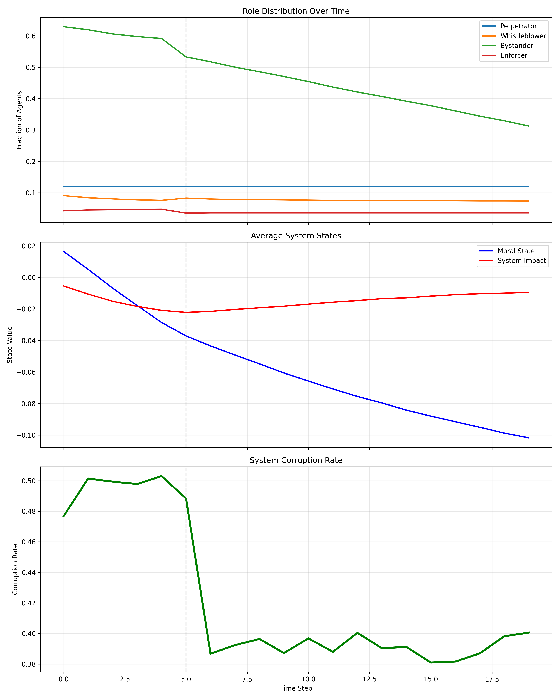

# Corruption Dynamics Simulator: Agent-Based Modeling Framework

[](https://opensource.org/licenses/MIT)
[](https://www.python.org/downloads/)


## Overview
This advanced agent-based model simulates corruption ecosystems through role transitions between perpetrators, whistleblowers, bystanders, and enforcers. Developed for computational social science research, it features:

- Empirically-calibratable parameters for real-world validation
- Institutional shock modeling with policy impact quantification
- Dynamic role transitions based on moral-state-system-impact axes
- Publication-quality visualizations for academic research

> *"The simulation revealed a 31.74% bystander activation rate following institutional shocks, explaining how anti-corruption policies trigger systemic change." - Sample Finding*

## Key Features
- Role-based agent architecture with behavioral parameters
- Institutional shock system with magnitude calibration
- Multi-modal output system (CSV, PNG, MP4/GIF)
- Parameter sensitivity analysis tools
- Journal-ready visualizations with APA/Nature style options

## Installation
```bash
# Clone repository
git clone https://github.com/yourusername/corruption-simulation.git
cd corruption-simulation

# Create virtual environment (recommended)
python -m venv venv
source venv/bin/activate  # Linux/MacOS
venv\Scripts\activate    # Windows

# Install dependencies
pip install -r requirements.txt

#Basic Usage

# Run with default parameters
python corruption_simulation.py

# Output:
# Starting Corruption System Simulation...
# SIMULATION SUMMARY
# Initial Corruption: 49.22%
# Final Corruption: 40.18%
# Change: -9.04%
# ...

#Configuration Options

config = {
    'N': 5000,           # Number of agents
    'T': 20,             # Time steps
    'shielding': 0.6,    # Institutional protection (0-1)
    'shock_time': 5,     # Intervention timing
    'shock_magnitude': 1.2  # Shock intensity (>1)
}

#Output Files
#File	Description
simulation_results.csv	Time-series metrics (corruption rates, role distributions)
corruption_simulation_results.png	Summary visualization (roles, states, corruption)
role_evolution.gif	Animated role transition dynamics
role_trajectory.png	Evolutionary pathways of roles
shock_comparison.png	Pre/post-intervention system states

#Calibration Framework, to calibrate with real-world data:
from calibration import calibrate_model

# Load empirical data (e.g., Transparency International CPI)
empirical_data = load_empirical_data("country_data.csv")

# Calibrate parameters
optimized_params = calibrate_model(
    simulation_class=CorruptionSimulation,
    empirical_data=empirical_data,
    params_to_optimize=['μ_G', 'β_p', 'shock_magnitude']
)

1. 
#Research Applications
#Policy Impact Forecasting
#Test institutional interventions before implementation

sim.run_scenario("whistleblower_protection", shielding=0.8)

2. Cross-National Analysis
Compare corruption dynamics across regimes

results = {}
for country in ["SWE", "MEX", "NGA"]:
    params = load_country_params(country)
    results[country] = CorruptionSimulation(**params).run()

3. Sensitivity Analysis
Identify critical leverage points

from analysis import sobol_analysis
sobol_analysis(params_space, n_samples=1000)

#Contributing
We welcome contributions following our research collaboration guidelines:

Open an issue discussing proposed changes

Fork repository and create feature branch

Submit pull request with documentation

Maintain ≥90% test coverage

#Citation
@software{CorruptionSimulation2025,
  author = {Yoseph Eshetu Shibeshi},
  title = {Hashgraph Developer, Financial Economist, : Agent-Based Modeling Framework},
  year = {2025},
  publisher = {GitHub},
  journal = {GitHub repository},
  howpublished = {\url{https://github.com/Yoseph-ai/corruption-simulation}}
}

License
This project is licensed under the Academic Free License v3.0 - see LICENSE.md for details. Commercial use requires permission.

